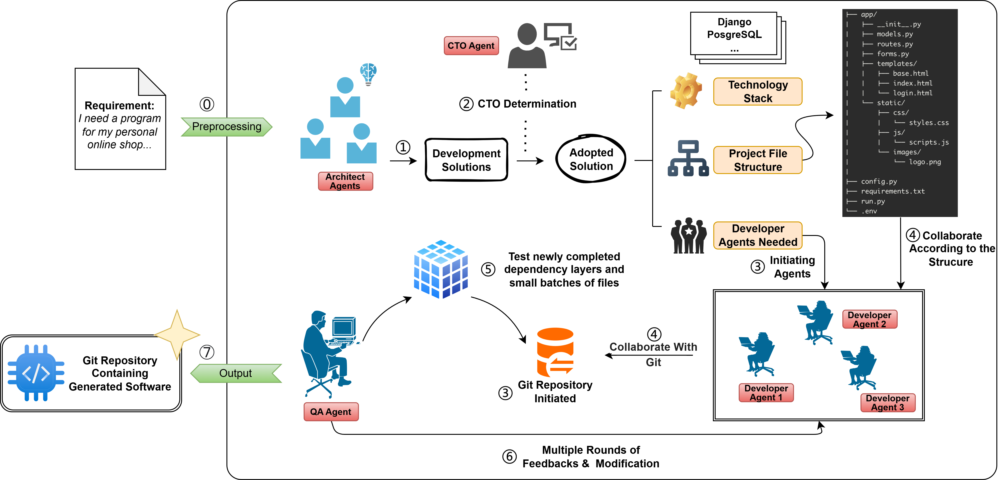

<div align="center">
  <h1>CodeTeam: An LLM-Powered Multi-Agent Framework for Repository-Level Code Generation</h1>
</div>
<div align="center">  
	<p>
    <a href="https://github.com/WhitenWhiten/CodeTeam">
      
    </a>
    <a href="">
      
    </a>
  </p>
</div>

# CodeTeam

**CodeTeam** is an LLM-powered multi-agent framework for repository-level code generation.
Given a project requirements document, CodeTeam aims to generate an entire repository from an empty workspace through coordinated planning, decision making, implementation, and repair.
The framework is designed for the natural language to repository generation (NL2Repo) setting, where systems must reason about file structures, interfaces, dependencies, and cross-file implementation details at the repository level.

## Framework Overview

<div align="center">
  
</div>

CodeTeam organizes repository generation into a multi-agent workflow.
Multiple Architect Agents first propose alternative software design sketches (SDSs), a CTO Agent selects and normalizes the final plan, Developer Agents implement files under dependency-aware scheduling, and a QA Agent tests and repairs the generated repository iteratively.
When retrieval is enabled, architects are additionally grounded with design-oriented references retrieved from a curated corpus of public GitHub repositories.

## ✨ Features

- **Multi-Agent Repository Generation**: CodeTeam decomposes repository-level code generation into specialized roles, including Architect, CTO, Developer, and QA agents.
- **Planning with Software Design Sketches**: Architect Agents generate SDSs that specify repository structure, interfaces, dependencies, and developer ownership before implementation begins.
- **Dynamic Developer Allocation**: The framework instantiates a task-specific number of Developer Agents based on the selected design plan instead of relying on a fixed assignment.
- **Git-Based Coordination**: Developer Agents coordinate through lightweight Git-style updates to propagate interface and dependency changes across files.
- **Iterative QA Repair Loop**: A QA Agent generates lightweight tests, executes the workspace, summarizes failures, and triggers repair until convergence or budget exhaustion.
- **Optional RAG Grounding**: Retrieval can be enabled to ground architectural planning with design-oriented references from public GitHub repositories.

## 🚀 Quick Start

### 1. Clone the repository

```bash
git clone https://github.com/WhitenWhiten/CodeTeam
cd CodeTeam
```

### 2. Create the environment

```bash
conda create -n codeteam python=3.11 -y
conda activate codeteam
pip install -r requirements.txt
```

### 3. Prepare configuration

Set up the required model, runtime, and workflow-related configurations according to your local environment.
If your project uses retrieval, make sure the retrieval corpus and related paths are configured properly before running the pipeline.

### 4. Run CodeTeam

Use the project entry script or application bootstrap to start a repository-generation run:

```bash
python app/main.py
```

If your local entrypoint is different, replace the command above with the corresponding startup script used in this repository.

### 5. Inspect generated repositories

Generated repositories are written to the workspace directory after execution:

```bash
ls workspace/
```

You can then run the generated project, inspect intermediate artifacts, or execute the repository test workflow for further evaluation.

## ⚙️ CodeTeam Workflow

CodeTeam generates a repository from an empty workspace in three stages: planning, decision making, and implementation. First, the input requirements document is preprocessed from the project README. Then, multiple Architect Agents propose alternative software design sketches (SDSs). Each SDS specifies the repository file tree, key dependencies, public interfaces, cross-file dependencies, and a project-specific developer plan, including how many Developer Agents should be instantiated and which files each developer should own. When retrieval is enabled, the architects are additionally grounded with design-oriented references retrieved from a curated corpus of public GitHub repositories.

After that, a CTO Agent evaluates the candidate SDSs, selects one plan, and normalizes it into an executable contract for the downstream stages. Based on the selected SDS, CodeTeam initializes the full file tree and instantiates the exact number of Developer Agents required by the plan. These developers implement their assigned files under a dependency-aware scheduler with bounded context, while a lightweight Git-based coordination mechanism is used to propagate interface changes across agents. Finally, a QA Agent generates lightweight tests, executes the workspace, summarizes failures, and triggers iterative repair until the repository converges or the global budget is exhausted.

In the experiments reported in the paper, all agents share the same backbone model family, Qwen3-72B-Instruct. The repository includes both prompting-based and supervised fine-tuning (SFT) settings for controlled comparison with prior NL2Repo baselines.

## 📊 Benchmarks

### SketchEval

SketchEval is the main benchmark used in this study. It contains 19 real-world Python repositories with requirements documents and reference implementations, and the tasks are grouped into easy, medium, and hard categories according to repository scale and dependency complexity. For each task, the model receives only the processed requirements document and must generate the repository from scratch in an empty workspace.

The main evaluation metric on SketchEval is SketchBLEU, a repository-level metric that measures n-gram overlap, weighted n-gram overlap, structural similarity, and dataflow similarity between the generated repository and the reference repository. In the paper, SketchEval is used as the primary benchmark for the main comparison with CodeS (PE/SFT), a vanilla single-model baseline, and adapted agent baselines.

### NL2Repo-Bench

NL2Repo-Bench is used as a complementary execution-based benchmark. It contains 104 tasks from real Python libraries and evaluates generated repositories by running the original upstream `pytest` suites. Compared with SketchEval, this benchmark places stricter emphasis on end-to-end executability, including package layout, dependency declarations, import consistency, and functional behavior under tests.

In this project, NL2Repo-Bench is used as an external validation benchmark for RQ1. The evaluation follows the document-only setting of the benchmark: agents do not see the target repository, scaffold, or test cases during generation. The intended metrics are average upstream test pass rate and Pass@1, together with the easy/medium/hard breakdown defined by the benchmark.

## 🧪 Ablation Study

The ablation study is designed to isolate the contribution of the main workflow components of CodeTeam under the prompting-based setting. All ablations keep the same backbone model, decoding configuration, budgets, and overall workflow wherever possible.

The full CodeTeam setting includes architect competition, RAG grounding, dynamic developer allocation, Git-based coordination, and the QA feedback loop. Three ablation variants are considered in the paper. The first removes RAG, so the Architect Agents design the SDS only from the requirements document. The second removes dynamic developer allocation and replaces the architect-planned developer count and file ownership with a fixed four-developer round-robin assignment. The third removes Git-based coordination by disabling the branch-based workflow and structured update messages, so agents can no longer rely on commit-based interface briefs.

These ablations are mainly evaluated on SketchEval. In addition to end-to-end SketchBLEU, the study also examines planning-stage and coordination-stage diagnostics, such as SDS parse success, structural validity, plan diversity, QA rounds, interface-mismatch failures, and average context size.

## 📁 Repository Structure

```plaintext
CodeTeam/
|-- actions/              # Action layer for Architect, CTO, Developer, and QA tasks
|-- app/                  # Application entrypoints and runtime bootstrap
|-- core/                 # Infrastructure for models, schemas, and repository management
|-- img/         		  # Images resources for this package
|-- orchestrator/         # Workflow orchestration across all agents
|-- prompts/              # External prompt templates used by different roles
|-- rag/                  # Retrieval-augmented generation logic and local corpus assets
|-- roles/                # Role wrappers for Architect, CTO, Developer, and QA agents
|-- runtime_adapters/     # Test execution adapters for Python runtimes
|-- scripts/              # Utility and helper scripts
|-- tests/                # Test suite for the repository itself
|-- utils/                # utilities for events, logging, routing, and SDS parsing
|-- workspace/            # Generated output repositories from workflow runs
|-- requirements.txt      # List of python run-time requirements 
\-- README.md			  # Description of this replication package
```

## 📝 Citation

```bibtex
@article{CodeTeam,
  author = {Wang, Yifei and Li, Ruiyin and Liang, Peng and Feng, Qiong and Li, Zengyang and Shahin, Mojtaba},
  title = {{CodeTeam: An LLM-Powered Multi-Agent Framework for Repository-Level Code Generation}},
  journal = {arXiv preprint arXiv:xxxx.xxxxx},
  year = {2026}
}
```
